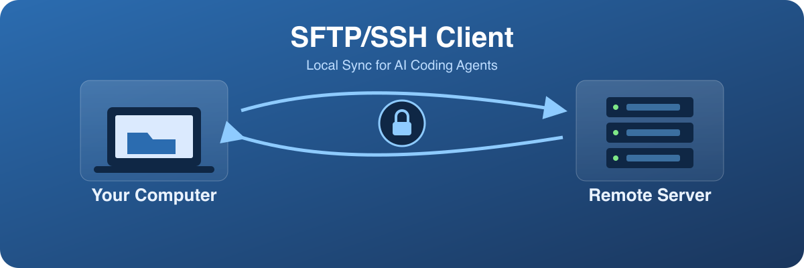
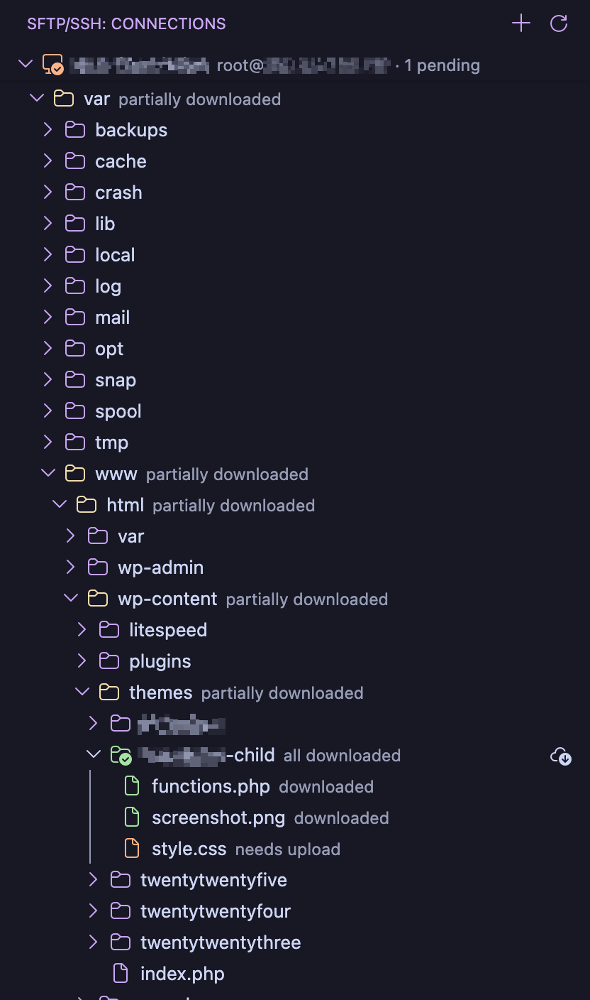
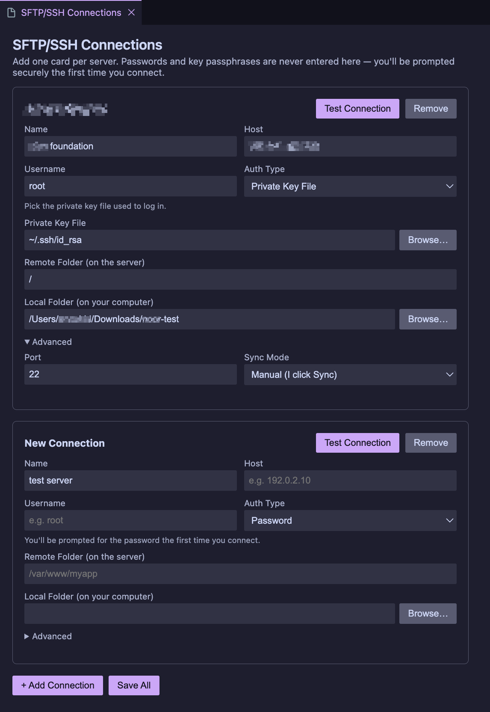
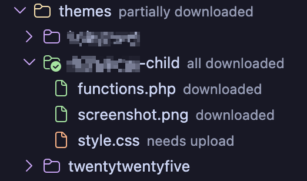
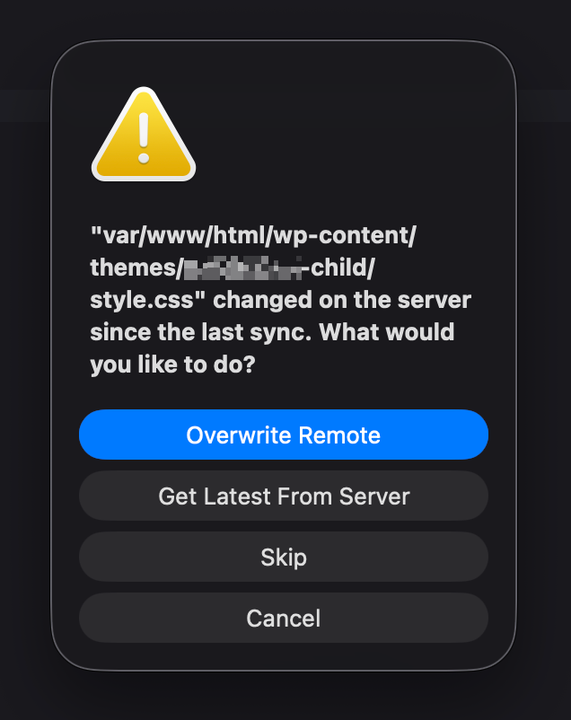

# SFTP/SSH Client — Local Sync for AI Agents



Pull a project from a remote SFTP/SSH server into a local folder, work on it with any AI coding agent (Claude Code, etc.) or your editor, then sync changes back up — built for hosts that don't allow agents to be installed directly on the server. Every connection is configured through friendly forms, never by hand-editing `settings.json`.

## Why

Some hosting providers block installing agent tooling on the server itself. The fix: mirror the project locally, let the agent work with full local tool access, then push the changes back over SFTP — with conflict checks so nothing on the server gets silently clobbered.

## Features

- **No JSON editing** — connections are added through a form panel with validation and file/folder pickers
- **Multiple auth methods** — password, private key file, SSH agent, or your existing `~/.ssh/config`
- **Browse before you download** — a sidebar tree lists the real remote filesystem, with per-file/per-folder download and upload actions
- **Manual or automatic sync** — click to sync, or turn on auto-sync per connection to upload changes as soon as you save
- **Conflict-safe** — detects when a file changed on the server (or locally) since your last sync and asks before overwriting, with the option to pull the newer version instead
- **Status at a glance** — Explorer badges, sidebar icons, a "N pending" counter per connection, and a status bar sync indicator



See [FEATURES.md](FEATURES.md) for the full list plus what's planned next.

## Install

Search **"SFTP/SSH Client — Local Sync for AI Agents"** in the VS Code Extensions view, or install from the [Marketplace](https://marketplace.visualstudio.com/items?itemName=murshid-ahmed.sftp-ssh-client).

## Getting started

1. **Add a connection.** Click the SFTP/SSH icon in the Activity Bar, then the **+** button (or run **SFTP/SSH: Manage Connections** from the Command Palette). Fill in the host, username, and how you authenticate; use **Browse…** for key files. Click **Test**, then **Save All**.

   

2. **Browse and download.** Expand your connection in the sidebar to see the real remote folder structure. Download the whole thing, or just the file/folder you need, via the hover icons.

   

3. **Edit locally**, with your AI agent, editor extensions, or anything else — it's a normal local folder.

4. **Sync back up.** Click **Sync Now** in the sidebar or status bar menu, or turn on **Auto-Sync** for that connection so edits upload automatically after each save.

   

## Commands

| Command | What it does |
|---|---|
| `SFTP/SSH: Manage Connections` | Open the connection form panel |
| `SFTP/SSH: Test Connection` | Verify a connection can authenticate |
| `SFTP/SSH: Download Workspace` | Pull a connection's whole remote folder locally |
| `SFTP/SSH: Sync Now (Upload Changes)` | Upload everything changed locally since the last sync |
| `SFTP/SSH: Toggle Auto-Sync` | Turn upload-on-save on/off for a connection |
| `SFTP/SSH: Disconnect` | Close the active connection |
| `SFTP/SSH: Upload This File/Folder` / `Download Latest From Server` | Right-click (or editor tab context menu) actions scoped to one file/folder |
| `SFTP/SSH: Mark as Synced (No Transfer)` | Re-establish tracking for a file/folder without transferring anything — useful after changing a connection's Remote Path |
| `SFTP/SSH: Show Menu` | Quick picker for all of the above, plus opening the log |
| `SFTP/SSH: Open Log` | Jump to the extension's Output channel |

Most of these are also available as hover icons directly in the sidebar tree and Explorer right-click menu — you shouldn't need the Command Palette for everyday use.

## Conflict safety

Before overwriting a file in either direction, the extension checks whether it changed unexpectedly since the last sync (e.g. someone edited it directly on the server, or you have local edits that haven't been uploaded yet). If so, you're asked to **Overwrite**, **Get Latest From Server** instead, or **Skip** — nothing is silently clobbered.

## Settings

All connection options (host, auth, paths, sync mode) live in **Manage Connections** — there are no separate global settings to configure.

## Development

```bash
npm install
npm run compile   # typecheck + bundle
npm run lint
```

Press `F5` in VS Code to launch an Extension Development Host for manual testing. See [PUBLISHING.md](PUBLISHING.md) for packaging and release steps.

## License

[MIT](LICENSE)
